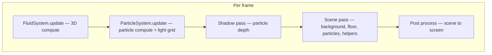

# WebGPU Particles

Browser demo: **millions-scale billboard particles** advected by a **3D stable-fluid** solver, with **spot-light shadows**, **color maps**, and a **volumetric glow field** derived from particle motion. Rendering uses an off-screen scene target plus post-processing (grain, vignette).

**Requirements:** A browser with **WebGPU** enabled (recent Chrome, Edge, or Safari Technology Preview, depending on platform).

## Run locally

```bash
npm install
npm run dev
```

`npm run build` produces static assets in `dist/` for deployment.

---

## Architecture (high level)



- **`Renderer`** (`src/core/`) owns the device, canvas, **scene color + depth** targets, and the animation loop. See [src/core/README.md](src/core/README.md).
- **`FluidSystem`** (`src/fluid/`) maintains ping-pong **velocity** and **density** volumes on a uniform grid. See [src/fluid/README.md](src/fluid/README.md).
- **`ParticleSystem`** (`src/particles/`) holds one GPU buffer of all particles, runs a **simulation** compute shader each frame, and draws **instanced quads**. See [src/particles/README.md](src/particles/README.md).

---

## How particles use the fluid

Both systems share the same **world scale** around the origin: roughly a ball of radius **`maxRadius`** (config + constructor). Anything expressed in “grid UV” uses the same mapping:

```text
uv = (worldPosition / maxRadius) * 0.5 + 0.5
```

So a particle at `position` samples the **same texel neighborhood** the fluid uses for that region of space.

**Frame order matters:** the fluid must be stepped **before** particles. In `src/main.js`, `fluidSystem.update(...)` runs first; then `particleSystem.update(...)` reads the fluid textures that were just written.

**Ping-pong textures:** velocity and density each have two 3D textures. `FluidSystem` flips read/write indices (`vIn`, `dIn`) during its compute pass. `ParticleSystem` keeps two **simulation bind groups**, and `main` passes **`fluidSystem.vIn`** so the particle compute shader samples the **`velocities[vIn]`** / **`densities[vIn]`** pair bound for that frame (see `simulationBindGroups` in `particle_system.js`).

**What the simulation shader does:** each particle reads **fluid velocity** and **density** at `uv`, combines them with per-particle **speed** and **extra** weights, and treats that as acceleration (plus **boundary** forces that push/limit motion inside `maxRadius`). There is no CPU coupling beyond uniforms and the shared buffer; all interaction is in `src/particles/shaders/simulation.wgsl`.

**Upstream of the fluid:** mouse, scene interaction, and procedural “tornado” splats call `fluidSystem.addForce(...)`, which stirs the velocity/density fields that particles then follow.

---

## How the light grid is set up

The **light grid** is a **`64 × 64 × 64`** auxiliary field used for **volumetric glow**: bright where particles move fast, faded toward the edges of the domain.

1. **Construction** — `ParticleSystem` creates a **`LightGrid`** (`src/particles/light_grid.js`) with the same **`maxRadius`** used for boundary and UV math. Internally:
   - a **storage buffer** of **`atomic<u32>`**, one cell per voxel;
   - a **`rgba16float`** **3D texture** for the stable result passed to shaders.

2. **Each frame** (inside `particleSystem.update`, on the same command encoder as particle simulation):
   - **`splat` compute** — one invocation per particle (batched in workgroups of 64). Each particle maps **`position`** to grid coordinates, applies edge falloff, and **atomically adds** a weighted contribution proportional to **`currentSpeed`** and **`glowIntensity`**. Trilinear weights spread each splat across up to **eight** voxels so the field is smooth.
   - **`post_process` compute** — a **`4×4×4`** workgroup walks the full grid, **reads and clears** each atomic with **`atomicExchange`**, normalizes the value, and **`textureStore`**s into the 3D texture.

3. **Consumers**
   - **Particles** — `particles.wgsl` samples **`glowTexture`** with the same **`(WorldPos / maxRadius) * 0.5 + 0.5`** mapping and adds a brightness term (see [src/particles/README.md](src/particles/README.md)).
   - **Floor** — `main.js` passes **`particleSystem.lightGrid.texture`** (and a sampler) into the floor so the ground shading can react to the same volume (see `floor.updateBindGroup(...)`).

So the grid is **entirely GPU-driven**: no CPU voxel grid, only uniforms (`deltaTime`, `maxRadius`, `glowIntensity`, decay constant) and the particle buffer after the simulation step has updated **`currentSpeed`**.

---

## Module documentation

| Area | Doc |
|------|-----|
| Renderer / frame loop | [src/core/README.md](src/core/README.md) · [src/core/renderer.md](src/core/renderer.md) |
| Fluid solver | [src/fluid/README.md](src/fluid/README.md) |
| Particles + light grid detail | [src/particles/README.md](src/particles/README.md) |
| Debug helpers | [src/helpers/README.md](src/helpers/README.md) |
