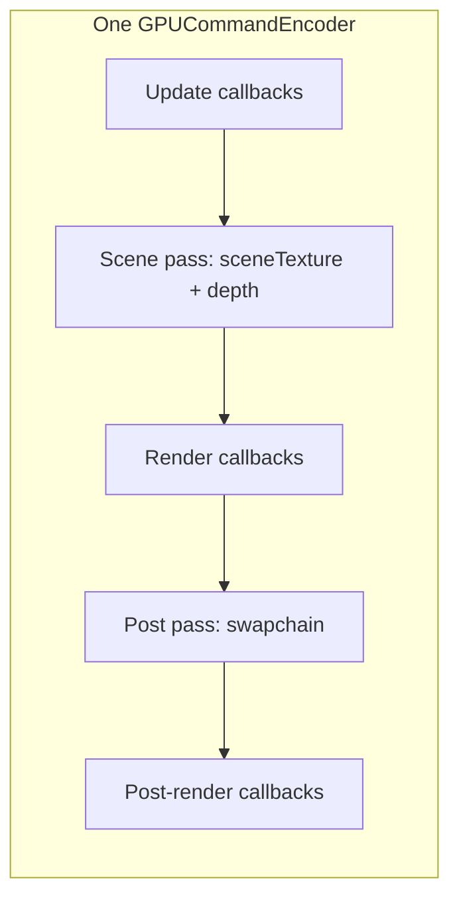

# Renderer (WebGPU core)

`renderer.js` exports **`Renderer`**, the central WebGPU host for this project. It acquires a GPU device, manages the canvas swapchain, maintains depth and off-screen scene color targets, and drives a fixed callback pipeline each frame.

There is no separate `WebGPU` class in this module; `Renderer` is the layer that wraps `navigator.gpu`, `GPUDevice`, and `GPUCanvasContext`.

## Responsibilities

| Area | What `Renderer` does |
|------|----------------------|
| **Initialization** | Requests a high-performance adapter, creates a device, obtains a `webgpu` context, picks the preferred canvas format. |
| **Resize** | Sizes the canvas (full window or fixed “target” layout via `Constants`), reconfigures the context, recreates depth + scene textures, notifies subscribers. |
| **Frame loop** | `requestAnimationFrame` loop with optional FPS throttling; tracks `deltaTime` and `totalTime`. |
| **Recording** | Builds one `GPUCommandEncoder` per frame: main scene pass → post pass to the swapchain. |

## Lifecycle

1. **`new Renderer(canvas)`** — Stores the canvas; callbacks and GPU handles start as `null`.
2. **`await init()`** — Must be called once. Throws if WebGPU is unavailable or no adapter is found. Returns the **`GPUDevice`** (same as `renderer.device`) for the rest of the app to create pipelines, buffers, and extra encoders.
3. **Register callbacks** — `addUpdateCallback`, `addRenderCallback`, `addResizeCallback`, `addPostRenderCallback`.
4. **`start()`** — Enters the animation loop.

## Public API

### Constructor

- **`constructor(canvas)`** — HTML canvas used for the WebGPU context.

### Initialization & loop

| Method | Description |
|--------|-------------|
| `async init()` | Sets up GPU; configures resize listener and runs initial `onResize()`. |
| `start()` | Begins `requestAnimationFrame(this.render)`. |

### Callback registration

Callbacks are invoked in order each frame (within their phase).

| Method | When it runs | Arguments |
|--------|----------------|-----------|
| `addUpdateCallback(cb)` | Start of `executeFrame`, before any encoding | `(deltaTime, totalTime)` |
| `addRenderCallback(cb)` | During the **scene** render pass (targets off-screen `sceneTexture` + depth) | `(pass, deltaTime, totalTime)` — `pass` is `GPURenderPassEncoder` |
| `addPostRenderCallback(cb)` | During the **post** pass (targets the swapchain / screen) | `(pass, deltaTime, totalTime)` |
| `addResizeCallback(cb)` | After internal texture recreation on resize | `(width, height)` — internal pixel dimensions (accounting for DPR / target mode) |

### Resize behavior

`onResize()` is internal but drives important state:

- Reads **`Constants`** from `../constants.js` (see [README](./README.md#coupling-note) if you reuse this folder):
  - **`useTargetDimension`** — If `true`, canvas backing store is `targetDimension × pixelRatio`, with CSS scaling and centering to fit the window.
  - Otherwise the canvas matches the window size × `pixelRatio` (with a minimum of 1 px).
- **`context.configure`** uses `alphaMode: 'premultiplied'` and `colorSpace: 'display-p3'`.
- **Depth** — `depth24plus`, same size as the canvas, render attachment only.
- **Scene color** — A `GPUTexture` with the canvas format, `RENDER_ATTACHMENT | TEXTURE_BINDING`, so the main pass renders off-screen and post-processing can sample `renderer.sceneView`.

Destroyed previous `sceneTexture` on resize before allocating a new one.

### Time and FPS

| Property | Meaning |
|----------|---------|
| `totalTime` | Accumulated seconds (starts from a random offset in `[0, 10000)` to vary noise/visuals across reloads). |
| `targetFPS` | `0` = uncapped; if `> 0`, frames are skipped until the budget allows, with clamped delta and catch-up logic. |
| `lastTime`, `accumulatedTime` | Internal pacing for throttled mode. |

`deltaTime` passed to callbacks is capped at **0.1 s** per frame to avoid huge spikes after stalls.

### Frame graph (single encoder)

Per `executeFrame`:

After `postRenderCallbacks` finish, the encoder is submitted with **`device.queue.submit`**.

**Note:** Other parts of the app (e.g. shadow passes in a parent `main.js`) may submit **additional** command encoders on the same frame; those are outside `Renderer` but share `renderer.device`.

## Exposed GPU state (read by the rest of the app)

After `init()` and at least one resize, these are valid for consumers:

| Property | Type / role |
|----------|-------------|
| `device` | `GPUDevice` |
| `context` | `GPUCanvasContext` |
| `format` | Preferred canvas format from `navigator.gpu.getPreferredCanvasFormat()` |
| `depthTexture` | Full-viewport depth target for the main scene pass |
| `sceneTexture` | Off-screen color target for the scene pass |
| `sceneView` | `GPUTextureView` of `sceneTexture` — typical input to post-process bind groups |

## Error conditions

- **`init()`** throws **`WebGPU not supported`** if `navigator.gpu` is missing.
- **`init()`** throws **`No WebGPU adapter found`** if `requestAdapter` resolves to `null`.

## See also

- In this repo: `src/main.js` constructs `Renderer` and wires the rest of the demo.
- Layout / resolution: `src/constants.js` — fields read by resize (`pixelRatio`, `targetDimension`, `useTargetDimension`).
