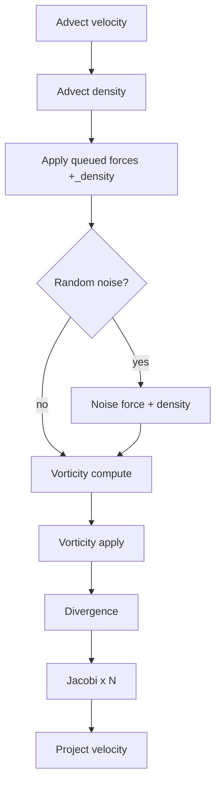

# Fluid

3D **stable-fluid** style simulation on a uniform grid, implemented in WebGPU compute shaders, plus a debug-style **glyph visualizer** (needles aligned to velocity). This folder is self-contained aside from shared utilities and one shader include (see [Dependencies](#dependencies)).

## Contents

| File | Role |
|------|------|
| `fluid_system.js` | Allocates 3D ping-pong textures, builds compute pipelines, records one command encoder per `update()` with the full solver schedule. |
| `fluid_visualizer.js` | Instanced box “needles” sampling velocity/density; draws into an existing render pass. |
| `shaders/fluid_solver.wgsl` | All compute entry points: advection, forces, optional noise, vorticity, divergence, Jacobi pressure, projection. |
| `shaders/fluid_visualizer.wgsl` | Vertex/fragment pass for the needle debug view. |

---

## Coordinate system and grid

- Simulation lives on an **`res × res × res`** grid (`FluidSystem.res`), stored as **`rgba16float`** 3D textures (`GPUUtils.create3DTexture`) for velocity and density. Pressure ping-pongs use **`r32float`**.
- **World space** in this demo is roughly centered: helper code maps world positions into normalized grid space using `maxRadius` (constructor argument, should match `FluidVisualizer` and anything calling `addForce`).
- `addForce(worldPos, dir, worldRadius, strength)` scales positions/directions/radius by `0.5 / maxRadius` so the sim matches that world extent.

---

## `FluidSystem`

### Lifecycle

- **`new FluidSystem(device, gridRes, maxRadius)`** — Sets defaults in `config`, pre-allocates CPU-side force/uniform packing, then calls **`init()`** (async, **not awaited** from the constructor). Until `init()` finishes, `update()` early-outs if pipelines/bind groups are missing.
- **`await`** is optional for the demo because `update()` guards on pipeline readiness; for stricter apps you could expose `init()` and await it before the loop.

### Ping-pong indices

State is double-buffered:

| Index | Meaning |
|-------|---------|
| `vIn` | Current **velocity read** slot (`velocities[vIn]` is “latest” for sampling). |
| `dIn` | Current **density read** slot. |
| `pIn` | Current **pressure read** slot for Jacobi iterations. |

Getters **`velocity`** and **`density`** return the textures named by `vIn` / `dIn` after the last completed `update()`.

### Config (`fluidSystem.config`)

Fields are uploaded each frame into the `FluidParams` uniform in WGSL:

- **`velocityDecay`**, **`densityDecay`** — Applied after advection (damping).
- **`pressureDecay`** — Applied in the Jacobi pressure update.
- **`forceStrength`** — Scales external forces and the optional noise force.
- **`vorticity`** — Vorticity confinement strength (see shader).
- **`pressureIterations`** — Number of Jacobi iterations per frame.

The `FluidParams` uniform includes **`time`** (`totalTime` from JS); the noise pass uses it in `fluid_solver.wgsl`.

### External forces

- **`addForce(worldPos, dir, worldRadius, strength)`** — Queues up to **`maxForces` (16)** spherical impulses for the next `update()`. The list is cleared after each `update()`.
- **`enableRandomForce(true)`** — When enabled, an extra compute pass adds **curl noise** to velocity (and a bit of density) using `#include "noise.wgsl"` (simplex/curl helpers).

### `update(deltaTime, totalTime)`

Encodes **one** `GPUCommandEncoder`, dispatches compute passes in order, then **`queue.submit`**. Workgroup layout is **`(8, 8, 4)`**; dispatch is `ceil(res/8)` in X/Y and `ceil(res/4)` in Z.

**Pipeline order (high level):**

1. **Advect** — Semi-Lagrangian backtrace for velocity; then density advected with the velocity field; decay factors applied.
2. **Forces** — Splats velocity and density inside each force’s radius (smooth falloff).
3. **Noise (optional)** — Curl-noise stirring.
4. **Vorticity** — Compute curl magnitude + vector into a scratch 3D texture (reused binding), then confinement force proportional to `vorticity * dt`.
5. **Divergence** — Central differences of velocity into `divergence` texture.
6. **Jacobi** — Iterative pressure solve with `pressureIterations` ping-pongs (`r32float` pressure).
7. **Project** — Subtract pressure gradient from velocity for a divergence-free(ish) field.

Other systems (e.g. particles) should sample **`fluidSystem.velocity`** / **`fluidSystem.density`** (or the raw `velocities`/`densities` arrays with the same `vIn`/`dIn` the demo uses) **after** this `update()` runs for the frame.

### Shader include

`fluid_solver.wgsl` starts with `#include "noise.wgsl"`. Resolution happens in `processShader()` (`src/utils/shader_utils.js`), which inlines files from elsewhere under `src/` (here: `src/particles/shaders/noise.wgsl`). If you copy **`fluid/`** alone, either copy that noise file and keep the include path valid for your bundler, or replace the noise pass with your own functions.

---

## `FluidVisualizer`

- Builds a **unit “needle”** box mesh (elongated along +X), one **instanced draw** per downsampled grid cell.
- **Downsample factor 3**: instance count is `(gridRes/3)³` (integer division in the shader; keep `gridRes` divisible by 3 for clean behavior).
- Each instance samples **`velTexture`** and **`denTexture`** at the cell center, scales/rotates the needle along **velocity**, length from **density**, and colors by **speed** or **direction** (`colorMode`: `0` vs `1`).
- **`render(pass, camera, fluidSystem)`** — Expects a `GPURenderPassEncoder` with a **depth** attachment (`depth24plus`, less-equal). Writes a new bind group each call (small overhead; fine for debug).

Uniforms pack **`camera.viewProjectionMatrix`**, `maxRadius`, `gridRes`, and `colorMode` into a single buffer.

---

## How the demo wires it

In `src/main.js`:

- Constructs **`FluidSystem`** and **`FluidVisualizer`** with the same **`gridRes`** and **`maxRadius`**.
- Each frame: copies **Config** fields into **`fluidSystem.config`**, applies pointer/audio forces via **`addForce`**, calls **`fluidSystem.update(deltaTime, totalTime)`**, then passes fluid textures into the **particle** system and calls **`fluidVisualizer.render(pass, camera, fluidSystem)`** inside the main scene pass.

Tweakpane sliders under “Fluid Simulation” map directly to **`config`** (see `src/ui/gui.js` / `src/config.js`).

---

## Dependencies

| Import | Purpose |
|--------|---------|
| `../core/gpu_utils.js` | `create3DTexture`, `createBuffer`, etc. |
| `../utils/shader_utils.js` | `#include` expansion for WGSL |

No dependency on `Renderer`; only needs a `GPUDevice` (and swapchain format for the visualizer’s color target).

---

## Porting / reuse

Copy **`src/fluid/`** plus the **`gpu_utils`** and **`shader_utils`** modules (and the **`noise.wgsl`** include target), or adjust imports. Replace or mirror **`Config`** / GUI wiring in your app. Keep **`gridRes`**, **`maxRadius`**, and force scaling consistent across solver, visualizer, and any advected particles sampling the same fields.
